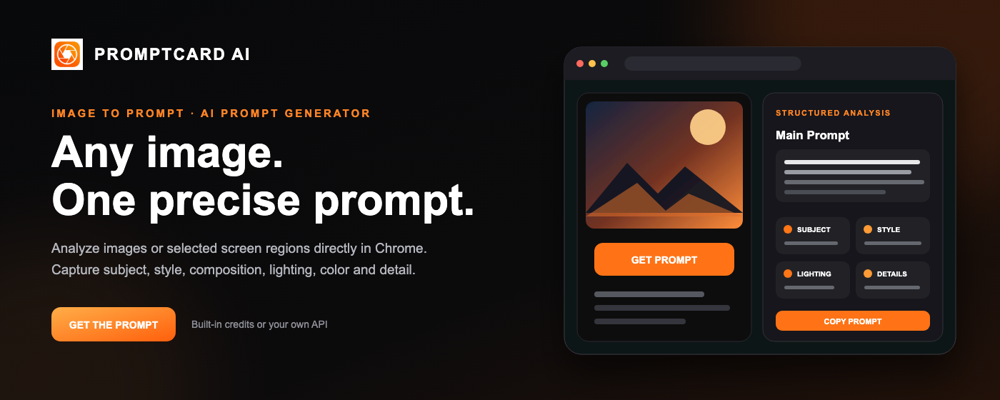
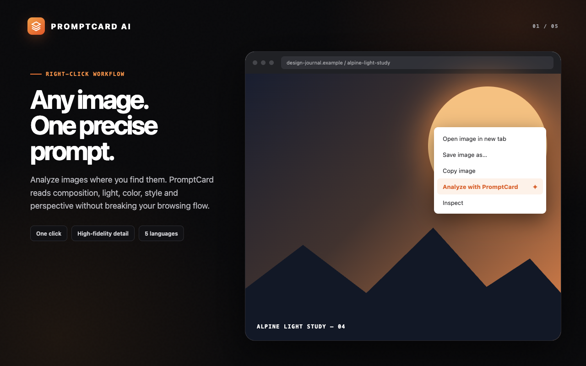
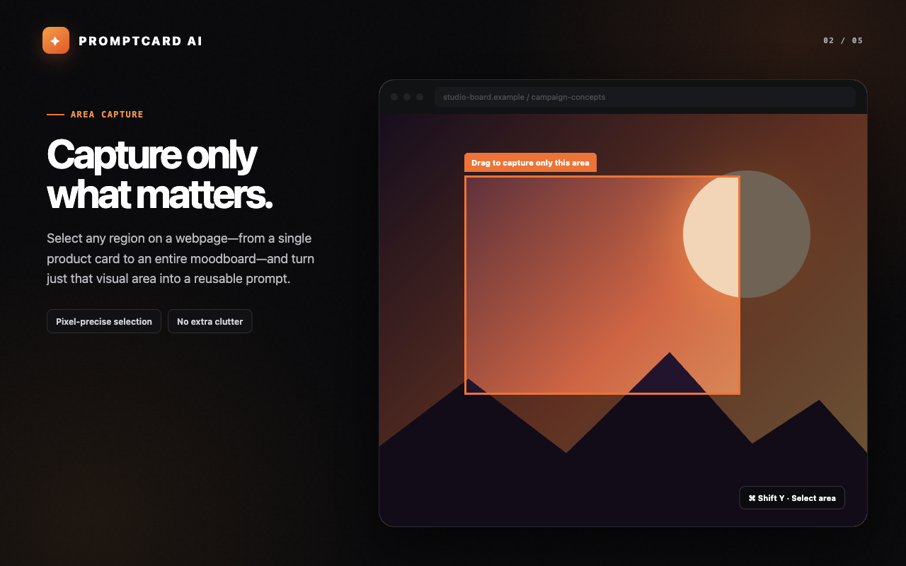
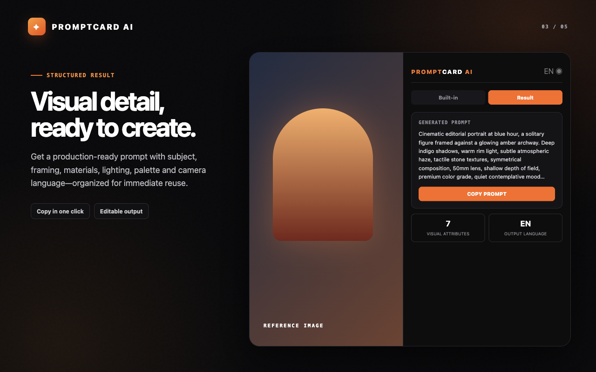
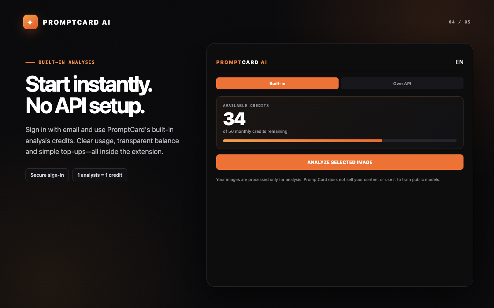

<div align="center">


# PromptCard AI — Image to Prompt

**Transform images and screen selections into detailed, high-fidelity AI prompts.**

[](https://developer.chrome.com/docs/extensions/mv3/intro/)
[](manifest.json)
[](LICENSE)



</div>

---

## 🌟 Key Features

- 📷 **Image-to-Prompt Generation:** Right-click any image on the web or upload local images to extract high-fidelity reverse-engineered prompts.
- ✂️ **Screen Area Capture:** Select any cropped region of your active browser tab for instant prompt extraction.
- 🧩 **Chrome Side Panel & Popup:** Access prompts seamlessly alongside your workflow without leaving your tab.
- ⚡ **OmniRoute & Custom AI Backends:** Compatible with built-in analysis services, OmniRoute AI Gateway, OpenAI-compatible APIs, or custom backends.
- 💳 **Credit & Subscription Billing:** Built-in billing management with LemonSqueezy integration.

---

## 🖼️ Screenshots

<div align="center">

| Image Analysis & Extraction | Screen Crop Selection |
| :---: | :---: |
|  |  |

| Side Panel Experience | Custom API & Settings |
| :---: | :---: |
|  |  |

</div>

---

## 🏗️ Architecture

```
prompt-card-extension/
├── manifest.json       # Chrome Manifest V3 configuration
├── background.js      # Service worker for context menus, capturing & message routing
├── content.js         # Content script for on-screen region selector UI
├── popup.html/js      # Popup & Side Panel interface
├── server.mjs         # Express backend server (Auth, AI Proxy & Billing)
├── store-assets/      # Chrome Web Store screenshots & branding assets
└── assets/            # UI icons & billing assets
```

---

## 🚀 Getting Started

### 1. Chrome Extension Installation (Developer Mode)

1. Clone this repository:
   ```bash
   git clone https://github.com/thecoldblooded/prompt-card-extension.git
   cd prompt-card-extension
   ```
2. Open Chrome and navigate to `chrome://extensions/`.
3. Enable **Developer mode** in the top right toggle.
4. Click **Load unpacked** and select the `prompt-card-extension` directory.

### 2. Backend Proxy Server Setup

1. Configure environment variables in `.env`:
   ```env
   PORT=3000
   LEMONSQUEEZY_STORE_ID=439814
   LEMONSQUEEZY_WEBHOOK_SECRET=your_secret_here
   LEMONSQUEEZY_WEBHOOK_URL=https://api.promptcard.umutdogan.space/v1/billing/webhook/lemonsqueezy
   ```
2. Start the backend server:
   ```bash
   node server.mjs
   ```

---

## 📜 License

Distributed under the MIT License. See `LICENSE` for more information.
